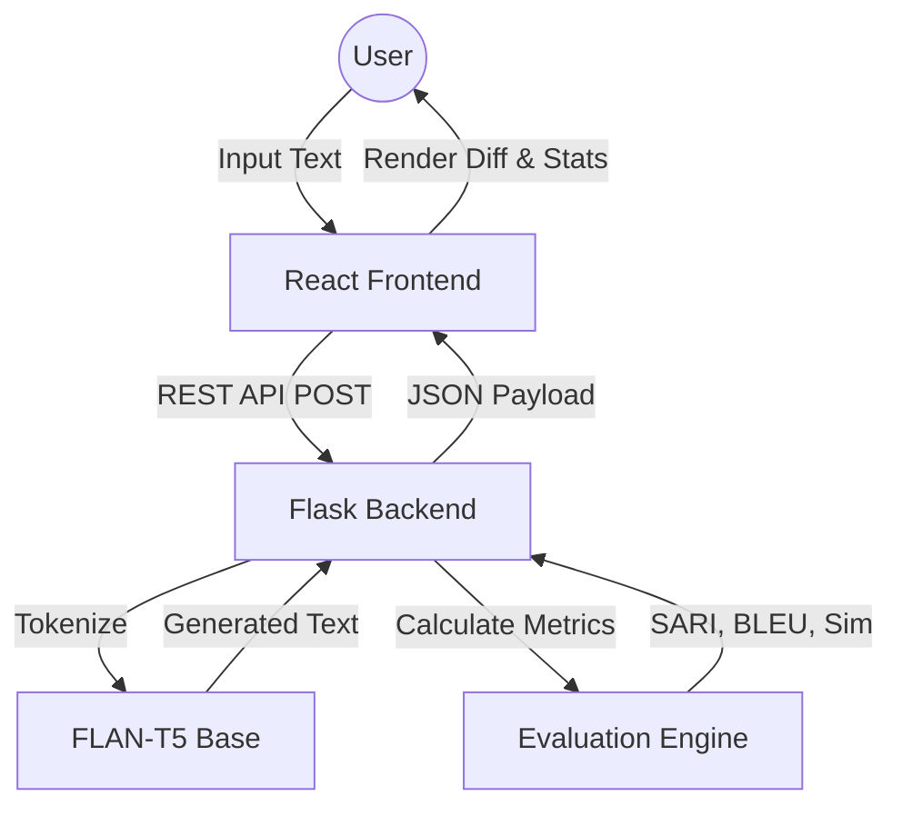

# 📚 Text Simplification & Meaning Preservation System

[](https://www.python.org/)
[](https://reactjs.org/)
[](https://huggingface.co/google/flan-t5-base)
[](#-license)

An end-to-end, research-driven text simplification platform designed to transform complex linguistic structures into accessible language while maintaining **100% semantic fidelity**. Powered by Google's **FLAN-T5 Base** transformer and evaluated via a multi-dimensional metric suite (SARI, BLEU, and Semantic Vector Similarity).

---

## 🏗️ System Architecture

Our system is built on a decoupled architecture ensuring high availability and separation of concerns between the inference engine and the interactive dashboard.



---

## 💡 Key Technological Innovations

### 1. Instruction-Finetuned Generation (FLAN-T5)
Unlike standard seq2seq models that use a simple `"simplify:"` prefix, our system leverages **FLAN-T5**, which is instruction-tuned on thousands of tasks. We utilize a highly targeted prompt:
> *"Rewrite the following sentence in very simple words so a child can understand: {text}"*

This forces the model to focus on **lexical replacement** and **syntactic thinning** rather than just summarization.

### 2. Semantic Fidelity via Vector Embeddings
Standard TS models often sacrifice meaning for simplicity. We bridge this gap by integrating a **Semantic Similarity Score**. Using `paraphrase-MiniLM-L3-v2`, we compute the cosine similarity between the original sentence vector and the output vector, ensuring the core intent remains preserved.

### 3. Visual Token-Level Analysis (LCS)
The system implements a custom Longest Common Subsequence (LCS) diffing algorithm. This allows users to see exactly which words were marked as **Complex** (removed), which were **Injected** (added/simplified), and which were **Preserved**.

---

## 📂 Project Repository Structure

```bash
.
├── backend/
│   ├── app.py                    # REST API Controller
│   ├── model.py                  # ML Inference Engine (T5 + Prompt Eng.)
│   ├── evaluation_metrics.py     # Multi-metric computation suite
│   └── data/
│       ├── comp-simp1.csv        # Kaggle Complex-Simple Dataset
│       └── final.csv             # Cleaned evaluation corpus
├── frontend/
│   └── src/
│       ├── App.js                # React UI with Accordion Sidebar
│       └── index.css             # Glassmorphic Design System
└── notebooks/
    ├── evaluation_analysis.ipynb # 📊 Full Statistical EDA (7 plots)
    └── upgraded_evaluation.ipynb # Pipeline verification
```

---

## 📚 Literature Survey & Theoretical Foundations

Our system is built upon the findings of key researchers in the field, categorized by their approach to the problem:

### Category A: Same/Similar Datasets (Kaggle/Parallel Corpora)
*   **Wei Xu et al. (2016)**: Introduced the **SARI** metric, addressing the limitations of BLEU by measuring the quality of additions and deletions independently.
*   **Sergiu Nisioi et al. (2017)**: Demonstrated the superiority of **Neural Seq2Seq** models over traditional phrase-based statistical machine translation.
*   **Zhang and Lapata (2017)**: Explored **Reinforcement Learning** to optimize for simplicity without losing fluency.
*   **Narayan and Gardent (2014)**: Pioneered **Hybrid** simplification combining semantic processing with machine learning.

### Category B: Methodology & Meaning Preservation
*   **Dhruv Kumar et al. (2019)**: Focused on **Controllable** simplification (ACCESS), inspiring our emphasis on specific task instructions.
*   **Pranav Maddela et al. (2021)**: Identified the "meaning loss" problem, which motivated our integration of **Semantic Vector Similarity**.
*   **Chenhui Chu et al. (2017)**: Conducted empirical studies on the trade-off between **Simplicity and Fidelity**.

---

## 📊 Evaluation Metrics

| Metric | Scientific Foundation | Target Goal |
|:---|:---|:---|
| **SARI** | Word Add/Keep/Delete quality | High Simplicity Output |
| **BLEU** | N-gram Overlap (Precision) | High Fluency Output |
| **Cosine Sim** | Sentence-Transformer Embeddings | **Meaning Preservation** |
| **FK Grade** | Syllable-to-Word Ratios | Accessibility Target |

---

## 🛠️ Installation & Deployment

### Backend Prerequisites
- Python 3.8+
- PyTorch (CPU or CUDA)
- `transformers`, `flask`, `sari`, `evaluate`

```bash
# Set up Virtual Environment
cd backend
python -m venv venv
.\venv\Scripts\activate

# Install Dependencies
pip install -r requirements.txt
python app.py
```

### Frontend Prerequisites
- Node.js (v16+)
- npm

```bash
cd frontend
npm install
npm start
```

---

## 📊 Evaluation & Results
The system is benchmarked using the `notebooks/evaluation_analysis.ipynb` which performs a full EDA with **7 distinct visualizations**, covering word count distributions, grade level shifts, and compression ratios.

---

## 📄 License & Attribution
**Manasa Saragalla** · Senior Project · Academic Research Program.
Built with FLAN-T5 Base and Sentence-Transformers. Optimized for Accessibility and Research Integrity.
